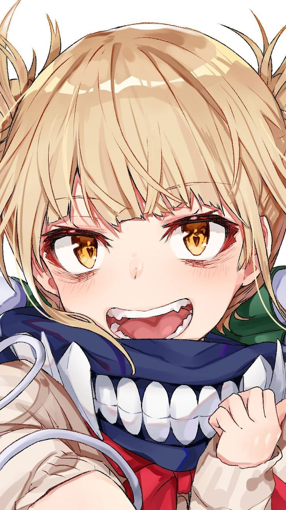

##  Hello, My Name is Darkness

  
  
 

###  &nbsp;Personal Stuffs
- Currently I like to study `Mathematics`.
- I'm just experimenting here.
- Main Language: &nbsp;

  

- Frameworks: &nbsp;

  

###  &nbsp;GitHub Analytics

---

